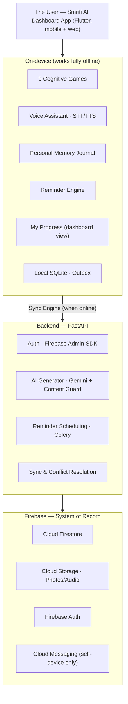

<div align="center">

# Smriti AI

### An offline-first personal cognitive wellness companion for elders — one simple dashboard, entirely their own

**Smriti AI turns daily cognitive-stimulation games, a multilingual voice assistant,
a personal memory journal, and gentle daily reminders into one self-contained routine
that works with or without the internet — built entirely around the user, for the user.**


</div>

---

## One-line value proposition

Smriti AI is a single, offline-first dashboard app that gives an elderly user
culturally grounded cognitive games, multilingual voice guidance, a private memory
journal, and daily reminders — all built for **independent, self-directed use**, with
no other person's account, login, or oversight required to use it.

---

## The problem

Structured cognitive stimulation helps people with mild cognitive impairment and early
dementia, but most tools that could help assume things that don't hold for the people
who need them most:

- **Constant connectivity.** A game, voice prompt, or reminder that needs a live
  connection is useless exactly when it's needed — in low-signal areas.
- **A single national language.** Generic "brain training" content in an unfamiliar
  language or with unfamiliar imagery doesn't trigger recognition or engagement for
  elderly users who think and remember in their own language and culture.
- **Dependency on someone else being present.** Many existing tools are built around a
  second person — a caregiver, a family member — watching, tagging photos, or approving
  content. That is not always available, and it is not the point of this product.
  Smriti AI is designed so a person can build a memory-care routine **entirely on their
  own terms**, privately, at their own pace, without needing anyone else's account,
  attention, or intervention. The goal is to strengthen the user's own mind and daily
  wellbeing — not to create a monitoring relationship.

---

## The product

Smriti AI is **one dashboard app**, not a set of separate apps for different people.
Everything a user needs lives in a single home screen:

- 🧠 **Cognitive games** — 9 mini-games across 6 cognitive domains, playable in a few
  taps directly from the dashboard.
- 🎚️ **Adaptive difficulty** — a transparent, rule-based engine that quietly adjusts
  each game's difficulty based on the user's own recent performance.
- 🗣️ **Multilingual voice assistant** — the whole app can be spoken to and heard,
  in the user's own language.
- 📓 **Personal Memory Journal** — a private space where the user (or, if they choose,
  the user themselves through guided prompts) saves their own photos and voice notes,
  which the app turns into gentle reminiscence activities and AI-narrated stories —
  never shared, never requiring anyone else to tag or approve it.
- ⏰ **Daily reminders** — medicine, hydration, and routine reminders that fire
  entirely on-device, with encouraging, non-judgmental follow-ups if one is missed.
- 📊 **My Progress** — a simple, plain-language view (part of the same dashboard, not
  a separate app) showing the user their own memory-game trends and streaks, framed
  around encouragement rather than clinical scoring.

There is **no separate web dashboard for a second party**, **no "caregiver" role**,
and **no feature that depends on family photos, family logins, or family approval**.
Every account on Smriti AI belongs to, and is used by, one person.

All data is written locally first (SQLite + outbox pattern) and synced to Cloud
Firestore the moment connectivity returns, with Firestore as the system of record
across the user's own devices only.

---

## Who it's for

| Persona | Need |
|---|---|
| **The User** — an elder with mild cognitive impairment or early dementia | A simple, private, voice-guided daily routine that builds their own memory and mood, without needing anyone else's involvement |

Smriti AI intentionally supports **one persona**. There is no secondary "monitor" role
in this product — see [Section 4 of the PRD](./PRD.md#4-target-user) for the reasoning
behind this design decision.

Initial focus: low-connectivity, multilingual regions of North-East India, with
launch-language support for **Assamese, Bengali, Hindi, and English**.

Full requirements and acceptance criteria for each feature: [PRD.md](./PRD.md).

---

## Core features

- 🧠 **9 cognitive mini-games** across `VISUAL_MEMORY`, `ATTENTION`, `SPATIAL`,
  `RECALL`, `REASONING`, and `NUMERACY`, seeded with culturally specific content
  (Bihu instruments, regional food, traditional homes, festival scenes) and dynamic
  content generated from the user's own Personal Memory Journal (e.g. "Recall My
  Memories").
- 🎚️ **Explainable adaptive difficulty engine** — a rule-based (not black-box) engine
  that promotes or demotes difficulty per cognitive domain from an EWMA-smoothed
  composite of accuracy, speed, and trend, with a human-readable reason attached to
  every decision, shown to the user themselves in plain language.
- 🗣️ **Multilingual voice assistant** — offline STT/TTS in English, Hindi, Assamese,
  and Bengali (offline-capable for Assamese and Bengali), with pre-authored, natural
  prompts rather than runtime machine translation.
- 📓 **Personal Memory Journal** — on-device photo storage and light auto-grouping of
  the user's own photos, simple self-tagging (place, event, object — not other
  people's identities tied to a family tree), and AI-narrated personal stories
  (Gemini) that pass through a content-safety guard before ever being shown or spoken.
  The user is the sole author and sole audience of their journal.
- ⏰ **Reminders with gentle follow-up** — offline local notifications for medicine,
  hydration, and routines. A missed reminder produces a second, kinder nudge and is
  logged to the user's own "My Progress" view — it does not notify anyone else.
- 📶 **Offline-first sync engine** — every write lands in a local SQLite outbox first;
  a background sync engine reconciles with Firestore (with conflict resolution) as
  soon as the device is back online, so the same user can pick up on a second device.
- 📊 **My Progress (in-dashboard)** — trend charts and streaks for the user's own eyes,
  built into the same single dashboard — not a separate product, login, or role.
- 🔐 **Simple, private access** — Firebase Auth (email/password, Google Sign-In, or
  device pairing for users who prefer not to manage credentials) enforced by
  Firestore/Storage security rules scoped strictly to the signed-in user's own
  `user_id`, plus explicit, revocable consent for photos, voice, and score collection.

---

## Architecture



| Layer | Responsibility |
|---|---|
| **Smriti AI dashboard app (Flutter)** | The one and only user-facing surface; must work with zero connectivity; builds to Android, iOS, and web from a single codebase |
| **Local SQLite (Drift) + outbox** | Durable local writes for games, scores, reminders, journal entries |
| **FastAPI backend** | Auth verification, AI story/quiz generation with content guard, reminder scheduling, sync support |
| **Cloud Firestore** | Primary, synced system of record — scoped per user, across that user's own devices only |
| **Cloud Storage** | The user's own photos and voice recordings |

There is intentionally **no second front-end application** in this architecture. Where
earlier drafts of this project included a separate web dashboard for a "caregiver"
role, that surface has been removed; its useful pieces (trend charts, alerts) were
folded into the "My Progress" view inside the single dashboard app instead.

---

## Tech stack

| Area | Technology |
|---|---|
| Dashboard app | Flutter (Android, iOS, Web from one codebase), Drift (SQLite), `speech_to_text`, `flutter_tts`, `flutter_local_notifications`, `workmanager` |
| Backend | FastAPI, Firebase Admin SDK, Celery + Redis, LangChain + `google-generativeai` (Gemini) |
| Data & infra | Cloud Firestore, Cloud Storage, Firebase Authentication, Firebase Cloud Messaging (self-device notifications only), region default `asia-south1` |

---

## Project structure

```
smriti-ai/
├── backend/
│   ├── app/
│   │   ├── core/
│   │   │   ├── config.py
│   │   │   ├── firebase_admin.py
│   │   │   ├── firestore_service.py
│   │   │   └── security.py
│   │   ├── models/
│   │   │   └── firestore_models.py
│   │   ├── routers/
│   │   │   ├── auth.py
│   │   │   ├── games.py
│   │   │   ├── journal.py
│   │   │   └── sync.py
│   │   └── services/
│   │       ├── adaptive_difficulty.py
│   │       ├── memory_game_generator.py
│   │       └── reminder_logic.py
│   ├── requirements.txt
│   ├── Dockerfile
│   └── service-account-key.json     # never committed — see .gitignore
│
├── dashboard_app/
│   ├── android/app/google-services.json
│   ├── lib/
│   │   ├── core/
│   │   │   ├── firebase/
│   │   │   ├── database/            # local SQLite (Drift)
│   │   │   └── sync/                # outbox sync engine
│   │   └── features/
│   │       ├── dashboard_home/      # the single "one dashboard" screen
│   │       ├── games/
│   │       ├── journal/             # Personal Memory Journal
│   │       ├── reminders/
│   │       ├── progress/            # "My Progress" trend view
│   │       └── voice/
│   ├── pubspec.yaml
│   └── firebase_options.dart
│
├── PRD.md
└── README.md
```

---

## Local setup

**Prerequisites:** Flutter SDK, Python 3.10+, a Firebase project, a Gemini API key.

```bash
git clone https://github.com/<your-org>/smriti-ai.git
cd smriti-ai

# 1. Firebase project
# Create a project at https://console.firebase.google.com/
# Enable: Authentication (Email/Password + Google), Firestore, Cloud Storage,
# Cloud Messaging. Generate a service-account key (Project Settings > Service Accounts).

# 2. Backend setup
cd backend
python -m venv .venv && source .venv/bin/activate
pip install -r requirements.txt
cp .env.example .env   # fill in Firebase + Gemini credentials
uvicorn app.main:app --reload --port 8000

# 3. Dashboard app setup (new terminal)
cd dashboard_app
flutter pub get
# Place google-services.json in android/app/
flutter run              # mobile
flutter run -d chrome    # web (same app, same dashboard)
```

### Environment variables

| Variable | Description |
|---|---|
| `FIREBASE_PROJECT_ID` / `FIREBASE_PRIVATE_KEY` / `FIREBASE_CLIENT_EMAIL` | Firebase Admin SDK credentials for the backend (from the service-account key) |
| `FIREBASE_STORAGE_BUCKET` | Cloud Storage bucket for the user's photos/audio |
| `GEMINI_API_KEY` | Powers AI-assisted memory-quiz and story generation |
| `REDIS_URL` | Broker for Celery-based reminder scheduling |
| Firebase web config (`apiKey`, `authDomain`, `projectId`, …) | Used by the dashboard app (mobile + web builds) to connect to Firebase |

`service-account-key.json` and all `.env` files are git-ignored and must never be
committed.

---

## Offline capabilities

- ✅ All 9 cognitive games work completely offline
- ✅ Voice STT/TTS works offline for Assamese and Bengali
- ✅ The Personal Memory Journal (photo storage, tagging, browsing) works fully offline
- ✅ Reminders fire offline via local notifications
- ✅ All writes land in local SQLite until sync
- ✅ Automatic sync with conflict resolution when connectivity returns
- ✅ Firestore offline persistence enabled as a second resilience layer

---

## Security & privacy

- Firestore and Cloud Storage security rules scope every read/write to the
  authenticated user's own `user_id` only — there is no `caregiver_uids` or
  `family_uids` field anywhere in the data model, because no other account can ever
  read a user's data.
- Firebase Admin (service-account) credentials are used **server-side only** and are
  never bundled into the app.
- Explicit, revocable consent records gate the collection of the user's own photos,
  voice samples, and cognitive scores.
- All AI-generated content (stories, quiz prompts) passes a content-safety guard
  before it can reach the user. Because there is no second-party approval step in
  this design, the content guard is the **only** safety gate — it must be strict by
  default (see [PRD §6.4](./PRD.md#64-personal-memory-journal)).

Deploy rules alongside every release:

```bash
firebase deploy --only firestore:rules
firebase deploy --only storage
firebase deploy --only firestore:indexes
```

---

## Testing & deployment

```bash
# Backend
cd backend && pytest

# Dashboard app — build release artifacts
cd dashboard_app
flutter build apk --release
flutter build appbundle --release
flutter build web --release

# Backend container
cd backend
docker build -t smriti-ai-backend .
gcloud run deploy smriti-ai-backend --image gcr.io/<your-project>/smriti-ai-backend
```

**Offline regression test:** install the release build, enable airplane mode, play
games, journal an entry, and create reminders, disable airplane mode, and verify
everything syncs to Firestore with no duplication or loss.

---

## Current status

Smriti AI follows a phased, Firebase-first build plan. Full functional requirements
and acceptance criteria for each phase are in [PRD.md](./PRD.md#12-roadmap--phased-delivery).

| Capability | Status |
|---|---|
| Firebase project (Auth, Firestore, Storage, Messaging) | Planned |
| Backend + Firebase Admin SDK orchestration layer | Planned |
| Single offline-first dashboard app (Flutter) | Planned |
| 9 cognitive games across 6 domains | Planned — 4 confirmed with seeded content |
| Multilingual voice assistant (4 languages) | Planned |
| Explainable adaptive difficulty engine | Planned |
| Personal Memory Journal (self-tagging, AI stories, content guard) | Planned |
| Reminders with gentle in-app follow-up | Planned |
| "My Progress" trend view (inside the single dashboard) | Planned |
| Security rules deployed & tested | Planned |

This table tracks what's designed in the build guide, not a claim of what's already
shipped — update it as each phase is implemented.

---

## Limitations

- AI-generated stories and quiz content depend on a configured `GEMINI_API_KEY`;
  without it, those features fall back to static, pre-authored content only.
- Offline voice is currently guaranteed only for Assamese and Bengali; English and
  Hindi voice features require connectivity unless/until on-device models are added.
- Because there is no second-party approval step, AI story generation must pass a
  strict, automated content guard on every single output — there is no human backstop.
- The Personal Memory Journal is designed for one person's own photos and memories; it
  is not a shared album and does not build a "who is this relative" graph.

---

## Roadmap

- **Near term** — complete the remaining 5 of the 9 cognitive games; on-device
  offline STT/TTS for English and Hindi.
- **Next** — richer "My Progress" insights (weekly summary, gentle encouragement
  messages); configurable reminder tone/frequency.
- **Later** — additional regional languages; wearable-device integration for
  vitals-aware reminders (still self-contained — data stays with the user).

---

## What changed from earlier drafts of this project

Earlier versions of this project (see the original SIH26003 problem statement)
included a caregiver/health-worker web dashboard, a family-photo-driven "Memory
Vault," and a "Family Game Mode" for remote co-play. This build intentionally
removes all of that:

- **No caregiver role, no caregiver dashboard, no caregiver term anywhere in the
  product.** There is one dashboard, and it belongs to the user.
- **No family-member connections.** Photos, tagging, and story approval are done by
  the user, for the user. Nothing requires a relative's account, upload, or consent.
- **Why:** the product's purpose is to strengthen the user's own memory, routine, and
  mood — a self-directed practice, not a relationship or a monitoring system.

Full rationale: [PRD.md §2](./PRD.md#2-problem-statement) and
[PRD.md §4](./PRD.md#4-target-user).

---

## License and contact

MIT — see [LICENSE](LICENSE).

Maintained by the Smriti AI team. Contact via GitHub issues on this repository.
