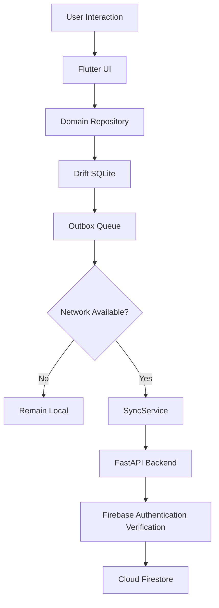

 # SMRITI-AI — Cognitive Care & Wellness Application

> An offline-first cognitive care and memory-support platform designed for elderly users, combining accessible Flutter experiences, local-first data persistence, contextual voice assistance, cognitive activities, AI-assisted journaling, and smart reminders.


---

## Table of Contents

* [1. What SMRITI-AI Does](#1-what-smriti-ai-does)
* [2. The Problem](#2-the-problem)
* [3. Project Vision](#3-project-vision)
* [4. Target Users](#4-target-users)
* [5. Core Design Philosophy](#5-core-design-philosophy)
* [6. Core Features](#6-core-features)
* [7. End-to-End System Flow](#7-end-to-end-system-flow)
* [8. Offline-First Architecture](#8-offline-first-architecture)
* [9. Data Synchronization Model](#9-data-synchronization-model)
* [10. Voice Assistant Architecture](#10-voice-assistant-architecture)
* [11. Cognitive Games Architecture](#11-cognitive-games-architecture)
* [12. Reminder & Notification Architecture](#12-reminder--notification-architecture)
* [13. AI Journal Architecture](#13-ai-journal-architecture)
* [14. Authentication & User Isolation](#14-authentication--user-isolation)
* [15. Security Model](#15-security-model)
* [16. Data Model](#16-data-model)
* [17. Technology Stack](#17-technology-stack)
* [18. Project Structure](#18-project-structure)
* [19. Local Development Setup](#19-local-development-setup)
* [20. Backend Configuration](#20-backend-configuration)
* [21. Flutter Configuration](#21-flutter-configuration)
* [22. Running the Backend](#22-running-the-backend)
* [23. Running the Flutter Application](#23-running-the-flutter-application)
* [24. API Overview](#24-api-overview)
* [25. Testing & Verification](#25-testing--verification)
* [26. Release APK](#26-release-apk)
* [27. Failure Modes & Recovery](#27-failure-modes--recovery)
* [28. Design Invariants](#28-design-invariants)
* [29. Operational Notes](#29-operational-notes)
* [30. Known Limitations](#30-known-limitations)
* [31. Roadmap](#31-roadmap)
* [32. Project Status](#32-project-status)
* [33. License](#33-license)

---

# 1. What SMRITI-AI Does

SMRITI-AI is an elderly-focused cognitive care and wellness application designed around a simple principle:

> **Technology should support memory and independence without making the user fight the technology.**

The application combines:

* Memory-support experiences
* Cognitive stimulation activities
* Context-aware voice interaction
* Personal journaling
* AI-assisted memory/story generation
* Smart reminders
* Local SQLite persistence
* Cloud synchronization
* Firebase-based authentication
* Elderly-friendly accessibility
* Offline-first operation

The system is designed so that important application data can continue to work locally even when network connectivity is unavailable.

The application separates:

```text
User Experience
       ↓
Domain Repositories
       ↓
Local SQLite Database
       ↓
Synchronization Queue
       ↓
FastAPI Backend
       ↓
Firebase Authentication
       ↓
Cloud Firestore
```

The local database remains the immediate source of truth for the application UI.

---

# 2. The Problem

Older adults may face difficulties with:

* Remembering appointments and daily activities
* Maintaining personal memories and stories
* Navigating complex mobile interfaces
* Maintaining regular cognitive stimulation
* Communicating with technology using conventional interfaces
* Using applications that assume strong vision, dexterity, or technical knowledge

Many applications are designed primarily around feature density rather than simplicity.

This creates a usability gap.

SMRITI-AI approaches the problem from the opposite direction:

```text
Complex technology
        ↓
Simplified interaction
        ↓
Clear visual hierarchy
        ↓
Large touch targets
        ↓
Voice assistance
        ↓
Memory-support features
```

The goal is not to replace caregivers, doctors, or family members.

The goal is to provide a **supportive digital companion and memory-assistance tool** that helps users interact with important everyday information more easily.

---

# 3. Project Vision

The long-term vision of SMRITI-AI is to create an accessible digital environment where elderly users can:

1. Record and revisit meaningful memories.
2. Receive reminders for important activities.
3. Engage with cognitive stimulation activities.
4. Interact using natural voice commands.
5. Receive context-aware conversational responses.
6. Continue using core features when offline.
7. Synchronize data securely when connectivity becomes available.

The design prioritizes:

```text
Simplicity
Accessibility
Privacy
Reliability
Continuity
Human-centered interaction
```

---

# 4. Target Users

## Primary Users

* Elderly users
* Users who benefit from simplified mobile interfaces
* Users who prefer voice interaction
* Users who need memory and routine assistance

## Secondary Stakeholders

* Family members
* Caregivers
* Researchers
* Educational institutions
* Healthcare/wellness technology researchers

SMRITI-AI is a **support and wellness application**. It is not intended to independently diagnose dementia or replace professional medical care.

---

# 5. Core Design Philosophy

## 5.1 Elderly-First Interface

The interface emphasizes:

* Large controls
* High contrast
* Clear labels
* Simple navigation
* Reduced visual clutter
* Consistent interaction patterns
* Large touch targets
* Gentle feedback

The application should not require the user to understand technical concepts.

---

## 5.2 Offline First

Network availability must not determine whether the core application can function.

Instead:

```text
User Action
     ↓
Local SQLite Write
     ↓
UI Updates Immediately
     ↓
Outbox Event Created
     ↓
Network Available?
   ↙        ↘
 No          Yes
 ↓            ↓
Remain      Sync
Local       With Backend
```

---

## 5.3 Local Database First

The application does not directly depend on the cloud for every UI operation.

Important local data is persisted using:

**Drift + SQLite**

This provides:

* Fast local access
* Offline functionality
* Persistence across application restarts
* Predictable UI behavior

---

## 5.4 Honest System Behavior

The application should never claim that an operation succeeded when it actually failed.

For example:

```text
Reminder saved successfully
+
Notification scheduling failed
```

must be communicated differently from:

```text
Reminder saved
+
Notification scheduled successfully
```

This principle is especially important for reminders and voice-created actions.

---

# 6. Core Features

## 6.1 Dashboard

The dashboard provides access to the major application modules:

```text
Home
 ├── Journal
 ├── Games
 ├── Reminders
 ├── Voice Assistant
 ├── Profile
 └── Settings
```

The home experience provides a simplified entry point rather than requiring users to navigate through complicated menus.

---

## 6.2 Memory Journal

The journal allows users to record personal memories and experiences.

The system can additionally support AI-assisted story generation from journal information.

Conceptually:

```text
User Memory
     ↓
Journal Entry
     ↓
Stored Locally
     ↓
Optional AI Processing
     ↓
Generated Memory Story
```

The AI layer is intended to assist the user, not fabricate personal history as fact.

---

## 6.3 Cognitive Games

SMRITI-AI currently contains four cognitive activities.

### Game 1 — Pitch the Correct One

The user receives:

```text
QUESTION
     ↓
INFORMATION / CLUE
     ↓
CHOOSE THE CORRECT ANSWER
     ↓
A / B / C / D
     ↓
Feedback + Explanation
```

The design intentionally separates the question and clue so that the user understands what information should be used before answering.

---

### Game 2 — Situation Match

The user is presented with an everyday situation.

The structure is:

```text
SITUATION
     ↓
QUESTION
     ↓
A / B / C / D
     ↓
Feedback
     ↓
Explanation
```

The feedback is designed to be encouraging rather than embarrassing.

---

### Game 3 — Find the Difference

The application presents visual scenes and asks the user to identify the difference.

The difference system uses normalized coordinates so that target regions remain consistent across different display sizes.

The important invariant is:

> The stored difference location must correspond to an actual visual difference rendered in the scene.

This prevents a mismatch between what the user sees and what the application considers correct.

---

### Game 4 — Draw a Shape

The user is asked to draw a specific geometric shape.

Supported classifications include:

* Circle
* Line
* Triangle
* Square
* Rectangle

The recognizer analyzes the user's stroke instead of accepting every drawing.

The recognition pipeline includes:

```text
Raw Points
    ↓
Filtering / Normalization
    ↓
Path Analysis
    ↓
Bounding Box
    ↓
Closure Analysis
    ↓
Straightness / Corners
    ↓
Circularity / Radial Analysis
    ↓
Shape Classification
```

The thresholds are intentionally forgiving to account for imperfect hand movement.

---

# 7. End-to-End System Flow

A normal local-first write follows this path:



The key principle is:

```text
LOCAL FIRST
     ↓
SYNC SECOND
```

not:

```text
NETWORK FIRST
     ↓
LOCAL FALLBACK
```

---

# 8. Offline-First Architecture

The application follows a layered architecture.

```text
┌───────────────────────────────────────┐
│              Flutter UI               │
│ Dashboard / Journal / Games / Voice   │
│ Reminders / Profile / Settings        │
└──────────────────┬────────────────────┘
                   ↓
┌───────────────────────────────────────┐
│          Domain Repositories           │
│ JournalRepository                      │
│ ReminderRepository                     │
│ GameRepository                         │
└──────────────────┬────────────────────┘
                   ↓
┌───────────────────────────────────────┐
│          Drift SQLite Database         │
│       Local Source of Truth            │
└──────────────────┬────────────────────┘
                   ↓
┌───────────────────────────────────────┐
│             Outbox Queue               │
│ create / update / delete               │
└──────────────────┬────────────────────┘
                   ↓
┌───────────────────────────────────────┐
│             SyncService                │
│ periodic + network-triggered sync      │
└──────────────────┬────────────────────┘
                   ↓
┌───────────────────────────────────────┐
│             FastAPI API                │
└──────────────────┬────────────────────┘
                   ↓
┌───────────────────────────────────────┐
│       Firebase Authentication          │
│       UID Ownership Verification       │
└──────────────────┬────────────────────┘
                   ↓
┌───────────────────────────────────────┐
│          Google Cloud Firestore        │
└───────────────────────────────────────┘
```

---

# 9. Data Synchronization Model

SMRITI-AI uses an outbox-style synchronization mechanism.

When a user changes data:

```text
Create / Update / Delete
        ↓
SQLite Transaction
        ↓
Outbox Event
        ↓
synced = false
```

When synchronization becomes available:

```text
Outbox
   ↓
SyncService
   ↓
POST /sync/batch
   ↓
Backend validation
   ↓
Firestore
   ↓
Success response
   ↓
Outbox event marked synchronized
```

The synchronization contract uses records containing information such as:

```json
{
  "records": [
    {
      "collection": "reminders",
      "client_generated_id": "reminder_<timestamp>_<uuid>",
      "operation": "create",
      "data": {}
    }
  ]
}
```

The backend returns processing results and successful record identifiers.

---

# 10. Voice Assistant Architecture

Voice interaction is divided into two different concepts:

```text
VOICE COMMAND
       vs.
CONVERSATION
```

This distinction is critical.

---

## 10.1 Voice Commands

Commands are explicit actions such as:

```text
Open the journal
Open games
Open reminders
Open settings
Open profile
Go home
```

The voice intent matcher uses action-oriented phrases rather than loose substring matching.

This prevents normal conversation from accidentally becoming navigation.

For example:

```text
"My daughter is going to USA for higher studies."
```

should be treated as a conversational statement, not as a Games command.

---

## 10.2 Conversational Understanding

The conversational engine can identify broad categories such as:

* Family news
* Happiness
* Sadness
* Loneliness
* Excitement
* Worry
* Missing someone
* Memories
* Achievements
* Travel
* Celebrations
* Daily activities
* Gratitude
* Confusion
* Health concerns

The system aims to provide:

```text
Context recognition
       ↓
Emotional acknowledgment
       ↓
Relevant response
       ↓
Natural follow-up question
```

The assistant should remain transparent that it is an AI assistant and should not impersonate a family member or claim to be a real person.

---

# 11. Cognitive Games Architecture

The games module follows a shared structure while allowing each game to have its own domain logic.

```text
BaseGameScreen
      │
      ├── PickCorrectScreen
      ├── SituationMatchScreen
      ├── FindDifferenceScreen
      └── DrawShapeScreen
```

Each activity provides:

* Clear instructions
* Accessible interaction
* Feedback
* Testable UI elements
* Deterministic game logic where appropriate

Automated tests verify both the underlying logic and important UI behavior.

---

# 12. Reminder & Notification Architecture

Reminders are intentionally divided into three separate stages.

```text
1. CREATION
       ↓
2. PERSISTENCE
       ↓
3. NOTIFICATION SCHEDULING
       ↓
4. NOTIFICATION FIRING
```

These stages must not be treated as one operation.

---

## 12.1 Reminder Creation

The reminder is validated first.

Required information includes:

* Reminder title
* Scheduled date/time
* Appropriate reminder metadata

---

## 12.2 Persistence

The reminder is written to local SQLite through:

```text
ReminderRepository
       ↓
Drift SQLite
```

Persistence should happen before notification scheduling.

---

## 12.3 Notification Scheduling

After successful persistence:

```text
ReminderRepository
       ↓
NotificationService
       ↓
Android Notification System
```

Notification scheduling failures must not delete or roll back the successfully saved reminder.

---

## 12.4 Voice-Created Reminders

Natural commands such as:

```text
Remind me to call my daughter at 7 PM
```

are processed through the same reminder pipeline.

The intended architecture is:

```text
Voice Input
     ↓
Intent / Reminder Parser
     ↓
Required Information Validation
     ↓
User Confirmation when needed
     ↓
ReminderRepository
     ↓
SQLite
     ↓
NotificationService
```

If date or time is genuinely ambiguous, the assistant should ask the user rather than silently inventing critical information.

---

## 12.5 Android Notification Recovery

Android-specific notification support includes:

* Notification channels
* Notification permissions
* Scheduled notification receivers
* Boot/restart recovery
* Local timezone handling
* Alarm scheduling
* Safe handling of exact-alarm restrictions

The system is designed to distinguish between:

```text
Reminder successfully saved
```

and:

```text
Reminder successfully saved
but notification scheduling was unavailable
```

---

# 13. AI Journal Architecture

The journal system provides a place for users to preserve personal memories.

The conceptual flow is:

```text
User
 ↓
Journal Entry
 ↓
Local Persistence
 ↓
Optional Synchronization
 ↓
AI Story Generation
 ↓
Readable Memory Narrative
```

The AI-generated output should be treated as an assisted interpretation of the user's provided information rather than an authoritative historical record.

---

# 14. Authentication & User Isolation

Firebase Authentication provides the identity boundary used by the backend.

The backend must not trust arbitrary client-supplied user identifiers for ownership decisions.

Instead:

```text
Authenticated Firebase UID
            ↓
Backend verifies identity
            ↓
UID determines data ownership
            ↓
Firestore access is scoped to that identity
```

This prevents one authenticated user from simply modifying a request body to access another user's records.

---

# 15. Security Model

Security is treated as an architectural requirement rather than a final add-on.

## 15.1 Identity Verification

The backend verifies Firebase authentication tokens before protected operations.

---

## 15.2 User Ownership

The authenticated UID is authoritative.

The client cannot choose another user's ownership simply by modifying:

```text
user_id
```

inside a request.

---

## 15.3 Local Data

SQLite provides local persistence for offline operation.

Sensitive credentials must never be committed to the repository.

Environment-specific secrets should remain outside source control.

---

## 15.4 API Configuration

Production configuration must use environment variables rather than hardcoded secrets.

Examples include:

```text
FIREBASE_PROJECT_ID
ALLOWED_ORIGINS
ENVIRONMENT
API_BASE_URL
```

Additional project-specific credentials should be supplied through secure deployment configuration.

---

## 15.5 Honest Failure Handling

The application should fail safely.

Examples:

```text
Cloud unavailable
      ↓
Continue using local database
```

```text
Notification unavailable
      ↓
Keep reminder saved
      ↓
Inform user honestly
```

```text
Invalid authentication
      ↓
Reject protected request
```

---

# 16. Data Model

The major logical entities include:

### Journal

Stores user-created memory/journal information.

### Reminder

Stores scheduled reminder information.

### Game Data

Stores game-related state and/or attempts where applicable.

### Outbox Event

Represents a local operation waiting to synchronize.

Typical operations:

```text
create
update
delete
```

Each locally generated record uses a collision-resistant identifier strategy.

Example:

```text
reminder_<timestamp>_<uuid>
```

This reduces the possibility of collisions during offline creation.

---

# 17. Technology Stack

| Layer                  | Component                           | Technology                                       |
| :--------------------- | :---------------------------------- | :----------------------------------------------- |
| **Mobile Application** | UI Framework                        | Flutter                                          |
|                        | Programming Language                | Dart                                             |
|                        | Local Database                      | Drift + SQLite                                   |
|                        | Authentication                      | Firebase Authentication                          |
|                        | Cloud Database                      | Google Cloud Firestore                           |
|                        | Backend API                         | FastAPI                                          |
|                        | Backend Server                      | Uvicorn                                          |
|                        | Backend Validation                  | Pydantic                                         |
| **Voice**              | Speech Input                        | Android/device speech recognition                |
|                        | Voice Output                        | Flutter TTS integration                          |
| **AI**                 | Journal / conversational assistance | AI integration layer                             |
| **Synchronization**    | Local Queue                         | Outbox Pattern                                   |
|                        | Sync API                            | FastAPI                                          |
| **Android**            | Notifications                       | Flutter Local Notifications + Android scheduling |
| **Testing**            | Flutter                             | Flutter Test                                     |
|                        | Backend                             | Pytest                                           |
| **Deployment**         | Backend                             | Docker / Render                                  |
| **Source Control**     | Repository                          | Git                                              |

---

# 18. Project Structure

```text
SMRITI-AI/
│
├── dashboard_app/
│   │
│   ├── lib/
│   │   │
│   │   ├── core/
│   │   │   ├── config/
│   │   │   ├── database/
│   │   │   │   ├── database.dart
│   │   │   │   ├── tables/
│   │   │   │   └── repositories/
│   │   │   ├── firebase/
│   │   │   └── sync/
│   │   │
│   │   ├── features/
│   │   │   ├── auth/
│   │   │   ├── dashboard/
│   │   │   ├── journal/
│   │   │   ├── games/
│   │   │   │   ├── pick_correct_screen.dart
│   │   │   │   ├── situation_match_screen.dart
│   │   │   │   ├── find_difference_screen.dart
│   │   │   │   ├── draw_shape_screen.dart
│   │   │   │   ├── shape_recognizer.dart
│   │   │   │   └── base_game_screen.dart
│   │   │   ├── reminders/
│   │   │   │   ├── reminder_entry_screen.dart
│   │   │   │   ├── reminders_screen.dart
│   │   │   │   └── services/
│   │   │   └── voice/
│   │   │       ├── voice_assistant_screen.dart
│   │   │       ├── voice_intent.dart
│   │   │       ├── voice_intent_matcher.dart
│   │   │       ├── voice_prompts.dart
│   │   │       ├── voice_conversation_service.dart
│   │   │       └── conversational_intent_engine.dart
│   │   │
│   │   └── main.dart
│   │
│   ├── assets/
│   │   ├── games/
│   │   └── branding/
│   │
│   ├── android/
│   │   └── app/
│   │       └── src/main/
│   │
│   ├── test/
│   │   ├── reminders_test.dart
│   │   ├── game_corrections_test.dart
│   │   └── voice_corrections_test.dart
│   │
│   └── pubspec.yaml
│
├── backend/
│   │
│   ├── app/
│   │   ├── core/
│   │   ├── routers/
│   │   ├── schemas/
│   │   └── main.py
│   │
│   ├── tests/
│   ├── Dockerfile
│   ├── requirements.txt
│   └── .env.example
│
├── render.yaml
├── README.md
└── LICENSE
```

---

# 19. Local Development Setup

## Prerequisites

Install:

* Flutter SDK
* Dart SDK through Flutter
* Python 3.12+
* Git
* Android Studio / Android SDK for Android development
* Node.js and Firebase CLI if Firebase emulator tooling is required

---

# 20. Backend Configuration

Navigate to:

```bash
cd backend
```

Create a virtual environment:

```bash
python -m venv .venv
```

### Windows PowerShell

```powershell
.venv\Scripts\Activate.ps1
```

### macOS / Linux

```bash
source .venv/bin/activate
```

Install dependencies:

```bash
pip install -r requirements.txt
```

Create environment configuration:

```bash
cp .env.example .env
```

On Windows, manually copy `.env.example` to `.env` if `cp` is unavailable.

Configure the required Firebase and backend settings.

---

# 21. Flutter Configuration

Navigate to:

```bash
cd dashboard_app
```

Install dependencies:

```bash
flutter pub get
```

If the project uses an environment file:

```bash
cp .env.example .env
```

Configure the backend URL according to the target environment.

For Android Emulator, localhost backend access normally uses:

```text
http://10.0.2.2:8000
```

For a deployed backend, provide the appropriate production/staging API URL through the project's configuration mechanism.

---

# 22. Running the Backend

From:

```bash
backend/
```

run:

```bash
uvicorn app.main:app --reload --host 0.0.0.0 --port 8000
```

Health endpoint:

```text
/health
```

Readiness endpoint:

```text
/ready
```

Interactive API documentation:

```text
/docs
```

Local backend:

```text
http://localhost:8000
```

---

# 23. Running the Flutter Application

From:

```bash
dashboard_app/
```

run:

```bash
flutter run
```

List available devices:

```bash
flutter devices
```

Run on Windows:

```bash
flutter run -d windows
```

Run on Chrome:

```bash
flutter run -d chrome
```

Run against a specific backend:

```bash
flutter run --dart-define=API_BASE_URL=<BACKEND_URL>
```

---

# 24. API Overview

The backend exposes health/readiness endpoints and synchronization APIs.

## Health

```http
GET /health
```

Used to determine whether the service is alive.

---

## Readiness

```http
GET /ready
```

Used to determine whether required backend dependencies/configuration are ready.

---

## Batch Synchronization

```http
POST /sync/batch
```

The synchronization endpoint processes local outbox records.

Conceptual request:

```json
{
  "records": [
    {
      "collection": "reminders",
      "client_generated_id": "reminder_123_uuid",
      "operation": "create",
      "data": {
        "title": "Call daughter"
      }
    }
  ]
}
```

The response provides processing results and successful record identifiers.

---

## Collection Synchronization

```http
GET /sync/{collection}
```

Used to retrieve synchronized records for the authenticated user according to the backend's ownership rules.

---

# 25. Testing & Verification

SMRITI-AI uses automated testing to prevent regressions across the application.

## Flutter Static Analysis

Run:

```bash
flutter analyze
```

Expected result:

```text
No issues found!
```

---

## Reminder Tests

Run:

```bash
flutter test test/reminders_test.dart
```

Current verified result:

```text
13/13 tests passed
```

---

## Complete Flutter Test Suite

Run:

```bash
flutter test
```

Current verified result:

```text
245/245 tests passed
0 failures
```

---

## Game Regression Tests

The game test suite covers:

* Circle recognition
* Line recognition
* Triangle recognition
* Square recognition
* Rectangle recognition
* Difference location logic
* Difference hit testing
* Pitch Correct UI
* Situation Match UI
* Find Difference UI
* Draw Shape UI

---

## Voice Regression Tests

Voice tests cover:

* Journal navigation
* Games navigation
* Reminder navigation
* Settings navigation
* Profile navigation
* Home navigation
* Conversation-vs-command separation
* Family milestone conversation
* Multilingual conversational behavior
* Voice reminder pipeline

---

## Backend Tests

From the backend directory:

```bash
python -m pytest
```

Also compile-check the backend:

```bash
python -m compileall app
```

---

# 26. Release APK

Build the Android release APK:

```bash
flutter build apk --release
```

The generated artifact is located at:

```text
build/app/outputs/flutter-apk/app-release.apk
```

The current verified prototype release build is approximately 66 MB.

Before distributing a release APK, it is recommended to validate:

* Installation
* First launch
* Launcher icon
* Splash screen
* Navigation
* SQLite persistence
* Voice functionality
* Notification delivery
* Background behavior
* Android permissions

---

# 27. Failure Modes & Recovery

SMRITI-AI is designed to avoid turning one subsystem failure into total application failure.

## Network Failure

```text
Network unavailable
       ↓
Local SQLite continues working
       ↓
Outbox stores pending operation
       ↓
Synchronization occurs later
```

---

## Cloud Failure

```text
Firestore unavailable
       ↓
Local application remains functional
       ↓
Pending operations remain queued
```

---

## Notification Failure

```text
Reminder creation
       ↓
SQLite save succeeds
       ↓
Notification scheduling fails
       ↓
Reminder remains persisted
       ↓
User receives truthful status
```

---

## Invalid Voice Command

```text
Unclear command
       ↓
Do not perform unrelated navigation
       ↓
Ask for clarification / provide fallback
```

---

## Missing Reminder Information

```text
"Remind me to call someone"
       ↓
Required time/date missing
       ↓
Ask user
       ↓
Do not invent critical information
```

---

## Authentication Failure

```text
Invalid / expired authentication
       ↓
Protected API request rejected
       ↓
No cross-user access
```

---

# 28. Design Invariants

The following principles are architectural rules of SMRITI-AI.

### 1. Local data must remain usable offline.

### 2. SQLite is the immediate local source of truth for the UI.

### 3. Cloud synchronization must not be required for basic local functionality.

### 4. Backend ownership decisions must use the authenticated Firebase UID.

### 5. Client-supplied user IDs must never override authenticated identity.

### 6. Every locally created record must use a collision-resistant identifier.

### 7. Reminder persistence must not depend on notification scheduling succeeding.

### 8. Notification failure must not silently delete a saved reminder.

### 9. Voice commands must be separated from normal conversation.

### 10. Navigation must require meaningful command intent.

### 11. Missing critical reminder information must be clarified rather than invented.

### 12. Cognitive-game feedback must be clear and non-embarrassing.

### 13. Shape recognition must analyze the actual stroke rather than accepting arbitrary drawings.

### 14. Find Difference target coordinates must correspond to an actual rendered visual difference.

### 15. AI-generated content must not be presented as verified personal history.

### 16. The assistant must not impersonate real family members or other people.

### 17. The application must report important failures honestly.

---

# 29. Operational Notes

## Offline Operation

Core local functionality is designed to remain available without network connectivity.

---

## Synchronization

The Outbox pattern allows operations to wait locally until synchronization becomes available.

Synchronization should be:

* Re-entrant protected
* Collision safe
* User scoped
* Failure tolerant

---

## Notifications

Android notification behavior depends on:

* Android version
* Notification permissions
* Device settings
* Battery/background restrictions
* Alarm restrictions
* Device timezone
* Android notification channel configuration

Therefore notification delivery should always be validated on an actual Android device before being described as fully production verified.

---

## Voice Recognition

Speech recognition quality depends partly on the Android device's available speech recognition services and installed language support.

---

# 30. Known Limitations

### Physical Android Validation

Automated Flutter tests cannot prove every Android-specific behavior.

Physical-device testing is required for final validation of:

* Notification delivery
* Background execution
* Boot recovery
* Android permission behavior
* Device-specific speech recognition
* Battery optimization behavior

---

### Speech Recognition

Voice recognition accuracy depends on the device's speech recognition engine and installed language packs.

This is particularly relevant for multilingual usage.

---

### AI Responses

AI-generated conversational and journal content is assistive and should not be treated as professional medical advice or as guaranteed factual reconstruction of a user's memories.

---

### Prototype Status

The current system is a working prototype/research build. Production deployment would require additional security review, privacy review, device compatibility testing, observability, and operational hardening.

---

# 31. Roadmap

## Phase 1 — Completed Core Prototype

* [x] Flutter application
* [x] Elderly-friendly dashboard
* [x] Journal
* [x] Cognitive games
* [x] Voice assistant
* [x] Smart reminders
* [x] SQLite persistence
* [x] Drift database
* [x] Outbox synchronization architecture
* [x] FastAPI backend
* [x] Firebase authentication integration
* [x] Firestore integration
* [x] Android branding
* [x] SMRITI-AI launcher icon
* [x] Splash screen
* [x] Automated regression testing

---

## Phase 2 — Device Validation

* [ ] Complete physical Android notification validation
* [ ] Background notification testing
* [ ] Reboot recovery testing
* [ ] Multiple Android-version testing
* [ ] Device-specific voice testing
* [ ] Accessibility testing with elderly users

---

## Phase 3 — Intelligence Improvements

* [ ] More advanced contextual conversation
* [ ] Improved multilingual interaction
* [ ] More personalized cognitive activities
* [ ] Better voice reminder extraction
* [ ] Improved journal story generation
* [ ] Personalized memory retrieval

---

## Phase 4 — Care Ecosystem

Potential future capabilities:

* Family/caregiver accounts
* Caregiver-approved information sharing
* Secure family notifications
* Long-term cognitive activity analytics
* Personalized daily routines
* Additional accessibility modes

These features require additional privacy, consent, authorization, and security design before implementation.

---

# 32. Project Status

Current engineering verification reported for the prototype:

| Verification                               | Result         |
| :----------------------------------------- | :------------- |
| Flutter static analysis                    | Passed         |
| Reminder tests                             | 13/13 passed   |
| Complete Flutter tests                     | 245/245 passed |
| Release APK build                          | Passed         |
| Backend architecture                       | Implemented    |
| Offline SQLite architecture                | Implemented    |
| Outbox synchronization                     | Implemented    |
| Voice navigation corrections               | Implemented    |
| Cognitive game corrections                 | Implemented    |
| Android notification pipeline              | Implemented    |
| Physical Android notification verification | Pending        |

### Current Release Artifact

```text
build/app/outputs/flutter-apk/app-release.apk
```

The APK has been successfully built, but final claims about Android-specific runtime behavior should be based on physical-device testing.

---

# 33. License

This project is intended as a prototype/research/educational project.

If a license file is included in the repository, refer to:

```text
LICENSE
```

---

# SMRITI-AI

```text
Memory Support
      +
Cognitive Engagement
      +
Voice Interaction
      +
Smart Reminders
      +
Offline-First Reliability
      +
Accessible Design
```

> **SMRITI-AI is built around one idea: technology should make everyday memory support simpler, calmer, and more accessible.**
